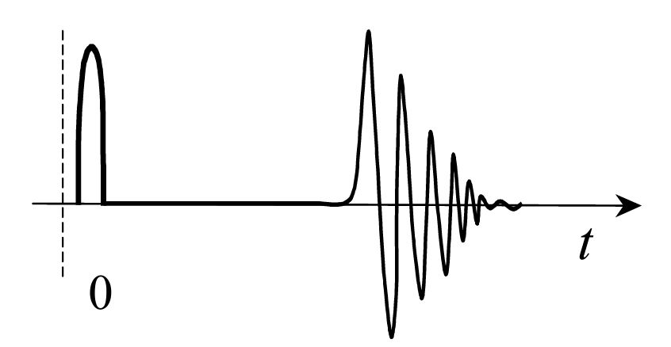

### Semi-physically-based Raindrops Generator

This is a Raindrop sound generator based on the paper from DAFx conference.

* **Computational Real-time Sound Synthesis of Rain**
  * http://huelights.com/docs/P_169.pdf

* The rain drops was modelled as 2 different stages, rain drops on hard surface and wet-surface. And a single drop last around 10-20 ms. The exact model was given in the paper above.

  

  Since no analytical solution resolution were given for the wet-surface model, I approximated the waveform with `exp(-t)sin(t)` function.

* This project supports VST and AU format for audio plugin in your DAW. 

* You can play around with these parameters

  * Gain - Overall audio gain
  * Density - How many drops per second
  * Freq Coeff - Controls overall frequency
  * Interval Coeff - Controls average duration of drops
  * Noise Level - White noise level 
  * High pass filter and Low pass filter
    * 12dB / Oct

* To make a procedural rain sound, you may use multiple tracks of Drops generator (High freq and Mid freq) and mix them with some level of white noise.
  * A good practice will be using these 4 different layers.
    * Light high-frequency boiling
    * Mid-frequency boiling
    * Stereo noise
    * Individual raindrops
  * This idea comes from this blog post, and I recommend you to check it out.
    * https://blog.audiokinetic.com/zh/generating-rain-with-pure-synthesis/


#### Build Instruction

##### Clone

This project uses JUCE as its submodule, please use `git clone --recurse-submodules [url-to-project]` to clone this project.

##### Build

This project use CMake for Compiling. `CMakeLists.txt` has been provided.

```bash
mkdir build
cd build
cmake ..
make
```


